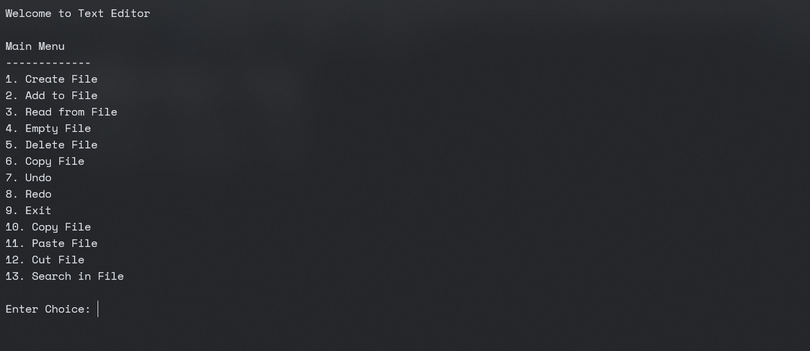

# Text Editor in C++

## Description

This is a simple text editor written in C++. It provides basic file operations such as creating, reading, updating, and deleting files. The editor also supports undo and redo operations, copy, paste, and cut operations.

## Features

- Create a new file
- Add text to a file
- Read from a file
- Empty a file
- Delete a file
- Copy a file
- Undo the last operation
- Redo the last operation
- Copy file content
- Paste file content
- Cut file content
- Exit the program

## Installation

To compile and run this program, you need to have a C++ compiler installed on your system. If you are using g++, you can compile the program by running the following command in the terminal:

```bash
g++ -o text_editor text_editor.cpp
```

This will compile the program and create an executable file named `text_editor`.

To run the program, use the following command:

```bash
./text_editor
```

## Usage

When you run the program, it will display a menu with the available operations. You can select an operation by entering its corresponding number. The program will then prompt you for any necessary input, such as the name of the file for the operation.

Here is a brief description of each operation:

- **Create File**: This operation creates a new file. You will be prompted to enter the name of the file.
- **Add to File**: This operation allows you to add text to a file. You will be prompted to enter the name of the file and the text to add.
- **Read from File**: This operation reads the content of a file. You will be prompted to enter the name of the file.
- **Empty File**: This operation empties the content of a file. You will be prompted to enter the name of the file.
- **Delete File**: This operation deletes a file. You will be prompted to enter the name of the file.
- **Copy File**: This operation copies the content of a file. You will be prompted to enter the name of the file to copy from.
- **Undo**: This operation undoes the last operation performed on the file.
- **Redo**: This operation redoes the last operation performed on the file.
- **Copy File**: This operation copies the content of a file. You will be prompted to enter the name of the file to copy from.
- **Paste File**: This operation pastes the content from the copy stack to a file. You will be prompted to enter the name of the file to paste to.
- **Cut File**: This operation cut

## Video Demo

[](https://file.garden/ZMu15i0EPHK4dj3e/Videos/dsa-project_demo.mp4)

## Authors

- Huzefa Saifuddin - 22K-5125
- Ijlal Iqbal - 22K-5034
- Ruhaan Ahmed - 22K-6014